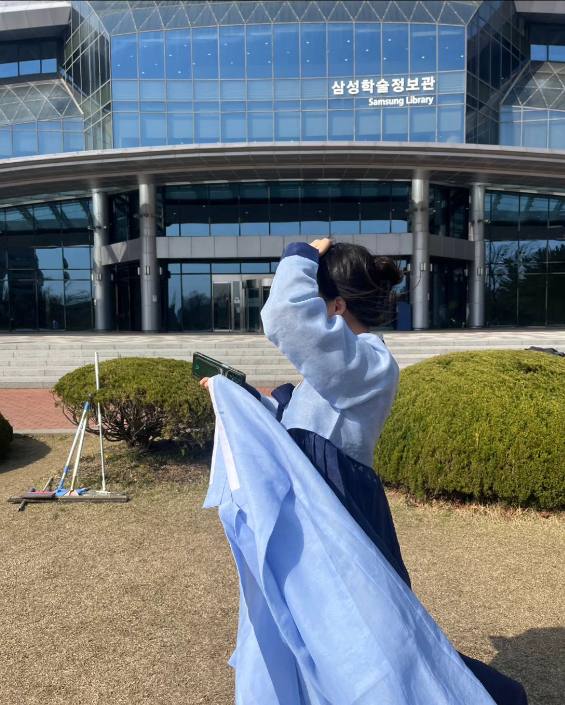

# Hi I'm _Lee Da-Yeon_

_20 years old, female, Korean_ \
Still looking for the interests. \
Participating in Industry-University Cooperation Project from this April : _Ninewatt_

---

>  __EDUCATION__
> > + Graduated Korean Minjok Leadership Academy in 2023
> > + Majoring Computing and Informatics as an undergraduate in Sungyunkwan University from 2023
> > >   Currently taking courses : _Computer Architecture_, _System Programming_, _Problem Solving_, and _Open Source Software Practice_

>  __SKILLS__
> > + C, C++, JAVA, Python

>  __ACHIEVEMENTS__
> > + Dean's list of 2023-1 
> > + Dean's list of 2023-2

>  __CONTACT__
> > + school email: noey0513@g.skku.edu
> > + github ID: noey0513
